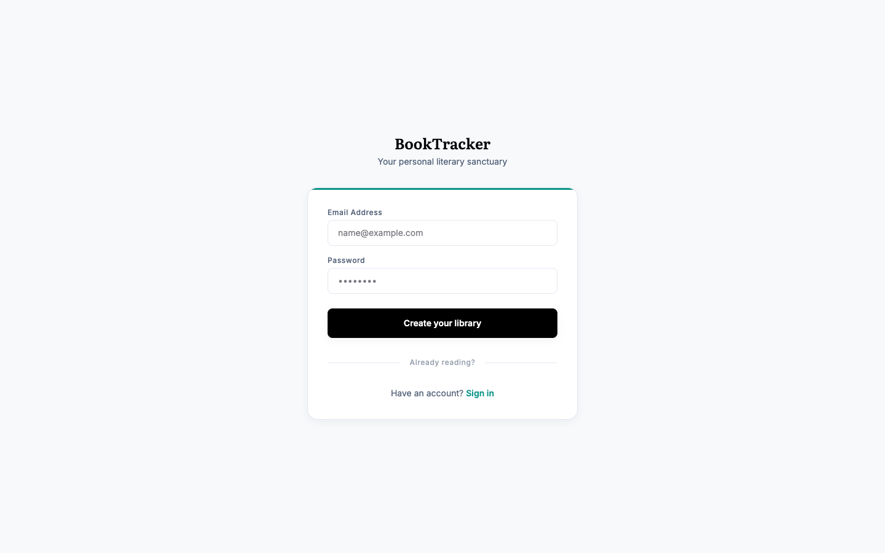
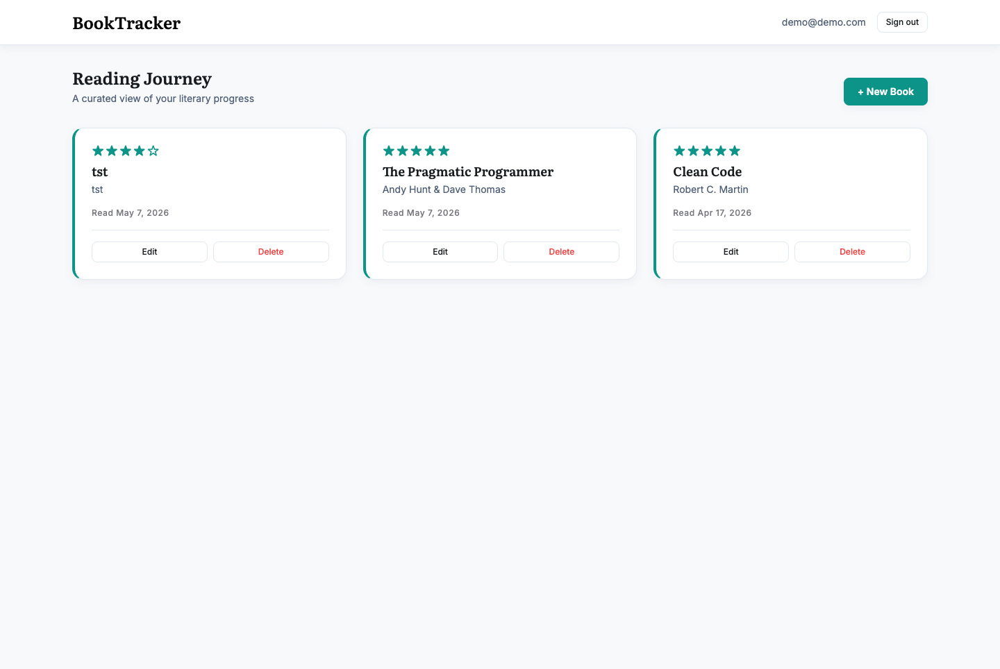
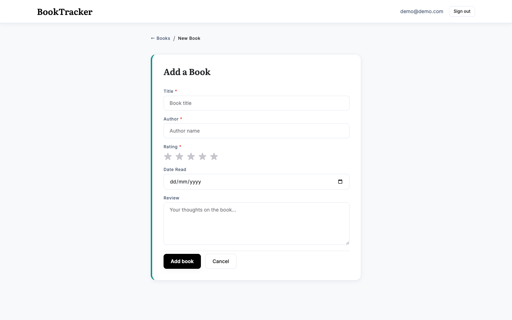

# BookTracker

Full-stack technical exercise: .NET 10 Web API + Angular 18 SPA + PostgreSQL.

> **User story** — As a book enthusiast, I want to log books I've read with a rating and a short review, so I can keep a personal history of my reading and see my progress over time.

## Architecture

Clean Architecture + DDD, four .NET projects with one-way dependencies:

```
backend/
├── BookTracker.slnx
├── Directory.Build.props
├── src/
│   ├── BookTracker.Domain          → Aggregates, value objects, repository contracts
│   │   ├── Common/                 — Entity, AggregateRoot, ValueObject, DomainException
│   │   ├── Users/                  — User (root), Email (VO), IUserRepository
│   │   └── Books/                  — Book (root), Rating (VO), IBookRepository
│   ├── BookTracker.Application     → Use cases, app-level abstractions, DTOs, validators
│   ├── BookTracker.Infrastructure  → ADO.NET repos, BCrypt, JWT, DbUp migrations
│   └── BookTracker.Api             → Controllers, JWT auth, Swagger, middleware
└── tests/
    └── one xUnit project per src/ project (Domain, App, Infra, Api)
frontend/
└── Angular 18 standalone SPA (signals, Reactive Forms, Tailwind)
```

Dependency rule — `Domain ← Application ← Infrastructure ← Api`. Domain references nothing.

### DDD building blocks

- **Aggregate roots** — `User` and `Book` each own their consistency boundary. Cross-aggregate references are by `Guid`, never by navigation.
- **Value objects** — `Email` and `Rating` enforce invariants at construction, expose value equality, and are immutable. A `Book` cannot exist with an invalid `Rating`; a `User` cannot exist with an invalid `Email`.
- **Repository contracts live in Domain** (`Users/IUserRepository.cs`, `Books/IBookRepository.cs`). Infrastructure implements them. Application orchestrates them.
- **No anemic entities** — `Book.Log`, `Book.Revise`, `User.Register` are intent-revealing factories/methods rather than property setters.

### Other design choices

- **No EF Core / no Dapper / no MediatR** (per exercise constraints). Persistence is raw `NpgsqlCommand` with typed `NpgsqlDbType` parameters. Migrations run via DbUp from embedded SQL scripts.
- **Primary constructors** (C# 12+) throughout services and use cases — less ceremony, fewer assignments.
- **Use cases are plain classes** invoked directly from controllers — no mediator pipeline.
- **Ownership enforced at the repository layer**: every `Book` query and command requires `user_id`. A user cannot read or mutate another user's books.
- **Aggregate roots use `Hydrate` factories** that re-validate invariants — corrupt DB rows fail fast at materialization time rather than silently leaking.
- **JWT bearer auth** with HS256 and a >=32 char signing key. `ICurrentUser` resolves `sub` from the JWT into a `Guid`.
- **RFC 7807 ProblemDetails** error responses through a single exception middleware (`NotFound`/`Conflict`/`Unauthorized`/`Validation`/`Domain` → corresponding status codes).
- **FluentValidation** at the API boundary; domain invariants enforced again inside aggregates (defense in depth).

## Stack

| Layer | Choice |
| --- | --- |
| Runtime | .NET 10 (C# 14) |
| DB | PostgreSQL 16 |
| Driver | Npgsql 10 (raw ADO.NET) |
| Migrations | DbUp 7 (embedded `.sql`) |
| Auth | JWT Bearer + BCrypt.Net-Next |
| Validation | FluentValidation 12 |
| API docs | Swashbuckle / Swagger UI |
| Tests | xUnit, FluentAssertions, NSubstitute, Testcontainers |
| Frontend | Angular 18 (standalone, signals), Reactive Forms, Tailwind |

## Prerequisites

- .NET 10 SDK
- Docker (Postgres runs in a container)
- Node 20+ (for the Angular app)

## Run

```bash
# 1. start Postgres
docker-compose up -d

# 2. run the API (migrations apply on startup, including the demo seed)
dotnet run --project backend/src/BookTracker.Api
#   → API on http://localhost:5000
#   → Swagger UI on http://localhost:5000/swagger

# 3. in another terminal, run the SPA
cd frontend
npm install
npm start
#   → Angular dev server on http://localhost:4200
```

### Demo credentials

```
email:    demo@demo.com
password: Demo@123
```

Three seed migrations run on boot (`0001_init.sql`, `0002_seed_demo.sql`, `0003_seed_more_books.sql`):
- Demo user `demo@demo.com` / `Demo@123`.
- 7 pre-seeded books in their library — Clean Code, The Pragmatic Programmer, Domain-Driven Design, Refactoring, The Mythical Man-Month, Designing Data-Intensive Applications, Working Effectively with Legacy Code.

## Screens

> All 4 screenshots live in `docs/screenshots/`. They were captured headless via Puppeteer-core driving real Chrome against the running stack — no Photoshop.

### Login — `/login`


Centered card on the brand background. Teal accent bar at the top (design system Level-2 elevation). Email + password with the seed creds work out of the box.

### Register — `/register`



Same layout language as Login. Password policy enforced by `RegisterRequestValidator` (>= 8 chars, upper + lower + digit) — server returns RFC 7807 field errors which Angular displays inline.

### Books list / Dashboard — `/books` (auth required)



Three-column card grid at desktop (collapses to 2 / 1 on tablet / mobile). Literata serif for titles, Inter sans for everything else. Teal left-border accent + Level-2 shadow that lifts to Level-3 on hover.

### Add / Edit book — `/books/new` and `/books/:id/edit`



Reactive form. Star-rating widget binds to a numeric `Rating` control (1–5). `readAt` is a `<input type="date">` so the browser provides the picker. Server-side validation errors land back in the same fields with red text via the ProblemDetails `errors` map.

## Demo flow — manual click-through

A guided ~2-minute tour you can use during the live demo:

1. **Visit `http://localhost:4200`** → guard kicks in → redirects to `/login`.
2. **Log in** with `demo@demo.com` / `Demo@123`. You'll land on the dashboard with 7 seeded books.
3. **Try sorting / inspecting**: hover any card — shadow lifts. Note the Literata serif on titles, teal stars.
4. **Create a new book** — click **+ New Book**. Sample data to type during the demo:

   | Title | Author | Rating | Read date | Review |
   | --- | --- | --- | --- | --- |
   | The Phoenix Project | Gene Kim, Kevin Behr, George Spafford | 5 | today | "DevOps story disguised as a novel." |
   | Accelerate | Forsgren, Humble, Kim | 4 | yesterday | "DORA metrics origin." |
   | Building Microservices | Sam Newman | 4 | 2026-04-01 | "Pragmatic guide." |
   | Site Reliability Engineering | Beyer et al. | 5 | 2026-03-15 | "Google's SRE bible." |

5. **Edit** — click **Edit** on any card. Form pre-fills via `GetBookUseCase`. Change the rating → **Save**. Card reflects new rating immediately.
6. **Delete** — click **Delete** on a created book. Confirm. Card disappears (optimistic UI, then server `DELETE`).
7. **Open Scalar UI** at `http://localhost:5184/scalar/v1` — auth dropdown takes the same JWT from `localStorage.bt_session.token`.
8. **Open the Bruno collection** (`backend/bruno`) for an alternative API client view with the full CRUD flow scripted.
9. **Sign out** — top-right. Session cleared from `localStorage`, guard kicks back to `/login`.

### Negative paths worth showing

- Wrong password on login → red toast: "Invalid credentials." (no leak of whether email exists).
- Empty title on create → inline field error from FluentValidation.
- Try to access `/books` without logging in → silent redirect to `/login`.
- Hit any authenticated endpoint with a stale token → 401 → interceptor clears session + redirects.

## Tests

```bash
cd backend && dotnet test
```

- **Domain.Tests** — 33 unit tests, aggregate invariants + value object equality
- **Application.Tests** — 17 unit tests with NSubstitute, use case behavior + ownership enforcement + validator failures
- **Infrastructure.Tests** — 10 integration tests via Testcontainers Postgres (`UserRepository`/`BookRepository` round-trips, cross-user isolation)
- **Api.Tests** — 4 end-to-end tests via `WebApplicationFactory` + Testcontainers (register → login → CRUD flow, 401 path, ProblemDetails shape, validation error shape)

> **64 tests total.** Infrastructure and Api tests need Docker running.

### Coverage

```bash
cd backend && dotnet test --settings coverlet.runsettings
dotnet tool install -g dotnet-reportgenerator-globaltool   # one-time
reportgenerator -reports:'tests/**/coverage.cobertura.xml' \
                -targetdir:TestResults/coverage \
                -reporttypes:'TextSummary;Html'
open TestResults/coverage/index.html
```

`coverlet.runsettings` excludes generated code (`Microsoft.AspNetCore.OpenApi.Generated`, source-generated regex, compiler-emitted helpers) and the `Program.cs` composition root + raw `.sql` migrations.

**Current numbers** (per `reportgenerator` summary):

| Assembly | Line | Method |
| --- | --- | --- |
| BookTracker.Api | 100% | 100% |
| BookTracker.Application | 100% | 100% |
| BookTracker.Infrastructure | 99.x% | 100% |
| BookTracker.Domain | 95.9% | ~95% |
| **Total** | **97.5%** | **94.5%** |

The remaining 2.5% line uncovered is split between a couple of auto-property setters on value objects and a `Rating.ToString()` overload nothing currently calls. Branch coverage is 66.6% — most of the missing branches are null-check arms on equality operators (`==`, `!=`) that aren't exercised by the existing tests because they don't compare against `null`.

Not 100%, and chasing the last 2-3% would be tests for code I'd just as soon delete. The Application + Api layers (where business decisions live) are at 100% — that's the meaningful target.

## API surface

| Method | Path | Auth | Purpose |
| --- | --- | --- | --- |
| POST | `/api/v1/auth/register` | anon | Create account, returns JWT |
| POST | `/api/v1/auth/login` | anon | Exchange creds for JWT |
| GET | `/api/v1/books` | JWT | List current user's books |
| GET | `/api/v1/books/{id}` | JWT | Get single book (owned) |
| POST | `/api/v1/books` | JWT | Create book |
| PUT | `/api/v1/books/{id}` | JWT | Update book (owned) |
| DELETE | `/api/v1/books/{id}` | JWT | Delete book (owned) |

OpenAPI document at `/openapi/v1.json` and Scalar reference UI at `/scalar/v1`.

### Bruno collection

A native [Bruno](https://www.usebruno.com/) collection lives in [`backend/bruno/`](backend/bruno/). Bruno is an open-source, git-friendly Postman alternative — collections are folders of `.bru` files, not a single JSON export. No import needed if you already have the repo.

**Open the existing collection (recommended):**

1. Install Bruno: `brew install --cask bruno` (or download from usebruno.com).
2. Bruno → **Open Collection** → pick `backend/bruno`.
3. Top-right environment selector → choose **Local**.
4. Run **Auth → Login (demo)**. The post-response script captures the JWT into the `token` env var.
5. Run any **Books** request — bearer header is injected from `{{token}}`.

**Migrating from Postman?** Bruno → **File → Import** supports Postman v2.1 JSON, Insomnia, OpenAPI, HAR. Drag the file into the import dialog. (Not needed here — the collection is already native Bruno.)

**Layout:**

```
backend/bruno/
├── bruno.json                       # collection metadata
├── README.md
├── environments/Local.bru           # baseUrl, apiVersion, demo creds, captured token
├── Auth/
│   ├── Register.bru                 # random email → token (captured)
│   └── Login (demo).bru             # demo creds → token (captured)
└── Books/
    ├── List.bru
    ├── Get.bru                      # uses seeded book id
    ├── Create.bru                   # captures lastBookId
    ├── Update.bru                   # uses lastBookId
    └── Delete.bru                   # uses lastBookId
```

**Suggested chain for demo:** Login → List → Create → Update → Delete. The captured `lastBookId` flows through the last three.

## TDD workflow

Commit history shows the red-green-refactor cycle layer by layer:

```
scaffold → domain (tests + entities) → review fixes
        → application (use cases + abstractions, NSubstitute)
        → infrastructure (ADO.NET + Testcontainers integration tests)
        → api (controllers + WebApplicationFactory integration tests)
        → docker-compose + seed
        → angular scaffold → angular feature commit
```

`git log --oneline` makes the progression auditable.

## Repository layout

```
.
├── README.md
├── docker-compose.yml
├── backend/
│   ├── BookTracker.slnx
│   ├── Directory.Build.props      # shared TFM, nullable, warnings-as-errors
│   ├── src/                       # 4 .NET projects
│   └── tests/                     # 4 xUnit projects, Directory.Build.props relaxes warnings
└── frontend/                      # Angular 18 SPA
```

## GenAI tooling — disclosure

I built this exercise inside **Claude Code** (Anthropic's official CLI for Claude) with a customized setup. This section documents both the *setup* (what's loaded into the assistant before any prompt runs) and the *workflow* (how I drove it during this build), then closes with concrete defects I caught in AI-generated code.

### My Claude Code setup

Everything below lives outside the repo, in `~/.claude/` and `~/Developer/`. It conditions the assistant on every session — the assistant doesn't "discover" my preferences each time.

#### Folder layout

```
~/.claude/
├── CLAUDE.md            # global personal rules (loaded into every session)
├── RTK.md               # Rust Token Killer cheatsheet (referenced from CLAUDE.md)
├── settings.json        # hooks, enabled plugins, status line
├── hooks/
│   └── rtk-rewrite.sh   # PreToolUse Bash hook → routes commands through `rtk`
├── plugins/             # marketplace caches for installed plugins
└── skills/              # user-defined skills (most live inside plugins now)

~/Developer/
└── CLAUDE.md            # project-level rules — agent routing table for multi-repo setup
```

#### CLAUDE.md hierarchy

Claude Code merges CLAUDE.md files top-down: `~/.claude/CLAUDE.md` → `~/Developer/CLAUDE.md` → repo `CLAUDE.md` (if present). My global one enforces a few hard rules: **never create git worktrees, never create branches unless asked, refuse skills/subagents that try to**. The Developer-level one defines an **agent routing table** so non-trivial tasks get dispatched to the right specialist automatically:

| Agent | Model | Use |
| --- | --- | --- |
| task-router | opus | classify vague requests, generate briefs |
| architect | opus | design plans, trade-off analysis |
| backend-dev | sonnet | implement .NET code |
| frontend-dev | sonnet | Razor/CSS/JS/Vue/Angular |
| code-reviewer | opus | PR review, security checks |
| qa-tester | sonnet | write & run tests |
| db-specialist | sonnet | migrations, schema, query opt |
| bug-solver | sonnet | root-cause + minimal fix |
| prd-writer | opus | translate vague asks into specs |
| doc-writer | haiku | README, comments, localization |

#### Plugins (`~/.claude/settings.json`)

The Claude Code plugin system lets you install bundles of *skills + agents + commands + hooks* from marketplaces. Active plugins on this machine:

- **superpowers** — adds the meta-skill `using-superpowers` plus a workflow library: `brainstorming`, `writing-plans`, `executing-plans`, `test-driven-development`, `systematic-debugging`, `verification-before-completion`, `requesting-code-review`, `receiving-code-review`. These convert "be thorough" from a wish into rigid checklists the assistant must walk through.
- **caveman** — the ultra-compressed communication mode you'll see in some of my commits. Drops articles/filler ~75% token savings on prose without losing technical substance. Has intensity levels (`lite`, `full`, `ultra`).
- **code-review**, **frontend-design**, **figma**, **playwright**, **context7** — domain skills.
- **dotnet-agent-skills** family (`dotnet`, `dotnet-data`, `dotnet-upgrade`, `dotnet-msbuild`, `dotnet-diag`, `dotnet-ai`, `dotnet-maui`) — official Microsoft skill pack with MSBuild diagnostics, P/Invoke guidance, EF Core query optimization, .NET upgrade migrations, etc.
- **skill-creator**, **claude-md-management** — meta-tooling for authoring skills and auditing CLAUDE.md files.
- **ralph-skills** — PRD-to-implementation pipeline.

#### Hooks

`settings.json` registers a `PreToolUse` hook on the `Bash` tool that routes commands through `rtk-rewrite.sh`. **RTK** (Rust Token Killer) is a CLI proxy that filters verbose dev-tool output (git, dotnet, docker) before it reaches the model's context — saves 60-90% of tokens on routine ops with zero behavioral change. The hook does the rewriting transparently; the assistant never sees the wrapping.

#### Skills vs Agents

- **Skills** are stateful procedures the assistant invokes via the `Skill` tool. They expand into instructions that override default behavior (e.g., `superpowers:test-driven-development` mandates write-test-first, no exceptions).
- **Agents** (subagents) are separate Claude instances spawned via the `Agent` tool with their own context window. I used `frontend-dev` three times in this build (initial Angular scaffold, ESLint/Prettier cleanup, Stitch design system application) and `code-reviewer` once (post-Domain review). Each subagent is briefed cold — its summary returns as a tool result to the main thread, so the heavy work doesn't bloat my window.

### How this exercise was driven

1. **Brainstorming + planning** done in the main thread; agents dispatched for execution work that would either flood my context (Angular setup, design system translation) or benefit from an independent perspective (code review on the Domain layer).
2. **Caveman mode active** for prose — kept my conversational responses terse. Code/commits/security always written normally.
3. **Small commits** as a contract: each commit builds + tests pass. The git log mirrors the layered TDD progression and is itself part of the deliverable.
4. **Skills enforced TDD discipline** — write a test, run it red, implement, run green, commit. The `superpowers:systematic-debugging` skill kicked in twice (DbUp `$2a$` parsing failure, Microsoft.OpenApi namespace migration).
5. **RTK saved tokens** on dozens of `git status`, `dotnet test`, `docker ps` calls during the build.

### Design system — generated with Stitch

The frontend visual language was not hand-designed. I used [**Stitch (Design with AI)**](https://stitch.withgoogle.com/) — Google's AI design tool — to generate:

- A **BookTracker Design System** artifact (`DESIGN.md`): full color palette (surface/primary/secondary/tertiary slate-navy + teal accent), dual-font strategy (Literata serif for book titles, Inter sans for UI), spacing/radius scales, elevation tokens, and component conventions.
- Three screen mockups: **Login**, **Dashboard**, **Detalhes do Livro**, each delivered as a `code.html` + `screen.png` pair.

The Stitch artifacts live outside this repo. They were the *source of truth* for the visual layer; my job was translating them into the Angular implementation:

- Design tokens → `tailwind.config.js` (`bg-surface`, `text-on-surface`, `border-outline`, `bg-tertiary`, etc.).
- Typography → Google Fonts (Literata 400/600/700, Inter 400/500/600) + Tailwind `@layer components` utility classes (`headline-md`, `book-title-card`, `label-md`).
- Mockups → restyled `login.component`, `register.component`, `list.component` (dashboard), `form.component` (detail-style edit screen) — preserving Angular bindings, replacing only the visual layer.
- Elevation/shadow tokens → custom `shadow-level-2` / `shadow-level-3` utilities.

What I dropped from the mockups (no backend support): sidebar nav, stats bar, book cover images, reading-status filter chips.

### Where AI helped

- Scaffolding ceremony — generating boilerplate for `.csproj` references, FluentValidation rule blocks, Swashbuckle bearer config, DbUp wiring, Angular service skeletons.
- Drafting JWT setup, exception-to-ProblemDetails mapping, and `WebApplicationFactory` Testcontainers fixture wiring.
- Translating between layers — given a use case, producing the matching DTO record and FluentValidation validator.
- Translating the Stitch-generated design system (above) into Tailwind tokens and restyled Angular components.

### What I had to correct or push back on

These are the recurring failure modes I caught in the AI output and fixed:

1. **SQL injection risk** — first repository draft concatenated `userId` into the SQL string. Forced it back to `NpgsqlCommand.Parameters.Add(..., NpgsqlDbType.Uuid)` everywhere. Every dynamic value in `BookRepository`/`UserRepository` is now a typed parameter.
2. **Ownership leak** — AI initially generated `BookRepository.FindAsync(Guid id)` without scoping by `user_id`. Anyone with a book GUID could read another user's data. Re-shaped the interface to require both `id` *and* `userId` on every query and command, then added an integration test that proves a user-B request for a user-A book returns `null`.
3. **Password equality vs verify** — first draft of `LoginUseCase` compared `request.Password == user.PasswordHash`. Replaced with `IPasswordHasher.Verify` which calls `BCrypt.Verify`. Added a unit test that exercises the wrong-password path.
4. **EF Core "helpfulness"** — even with an explicit ban in the prompt, the assistant suggested `DbContext` patterns more than once. Had to reinforce raw ADO.NET in the constraints and reject completions that pulled in `Microsoft.EntityFrameworkCore.*`.
5. **`Hydrate` skipping validation** — the original `Book.Hydrate` bypassed invariants for performance. A code-review pass flipped that decision: corrupt rows should fail at materialization, not at the next `Update`. Same change applied to `User.Hydrate`.
6. **DbUp variable substitution** — seed migration with the BCrypt hash `$2a$12$...` initially exploded because DbUp parses `$varname$` as a variable. Fix: `.WithVariablesDisabled()` on the builder.
7. **Microsoft.OpenApi 2.x namespace move** — Swashbuckle 10.x's old `OpenApiSecurityScheme { Reference = ... }` no longer exists; replaced with `OpenApiSecuritySchemeReference("Bearer")`. Caught by a build failure, not the AI.
8. **Test conventions** — generated tests sometimes used `Assert.True(...)` for booleans. Standardized on FluentAssertions and added the `Should().Throw<DomainException>()` pattern for invariant tests.

### What this demonstrates

AI accelerates the typing, not the thinking. Every security-sensitive boundary (auth, persistence, multi-tenant ownership) had a defect in the first AI-generated draft. The test suite — particularly the integration tests with a real Postgres — is what surfaced those defects. The workflow I'd recommend: **prompt for scaffolding, write the integration tests yourself, then let the test failures drive the correction loop.**

The Claude Code setup matters because it shifts AI from "autocomplete on demand" to "team of specialists with shared rules". The global CLAUDE.md is a contract; plugins encode discipline; agents protect context; hooks remove ceremony. The model is still fallible — the value is that the *system around the model* catches more of the failure modes before they reach the diff.
